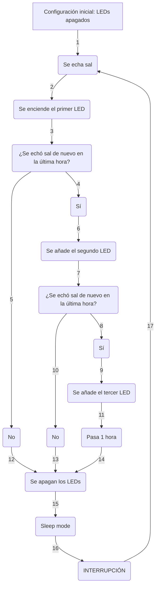

# 
 Salero Jóven Ocúpate Reto TicLab MdN 

  

 

_Hecho con_

 [![Build with PlatformIO](https://img.shields.io/badge/Compilado%20con-PlatformIO-orange?logo=data%3Aimage%2Fsvg%2Bxml%3Bbase64%2CPHN2ZyB3aWR0aD0iMjUwMCIgaGVpZ2h0PSIyNTAwIiB2aWV3Qm94PSIwIDAgMjU2IDI1NiIgeG1sbnM9Imh0dHA6Ly93d3cudzMub3JnLzIwMDAvc3ZnIiBwcmVzZXJ2ZUFzcGVjdFJhdGlvPSJ4TWlkWU1pZCI+PHBhdGggZD0iTTEyOCAwQzkzLjgxIDAgNjEuNjY2IDEzLjMxNCAzNy40OSAzNy40OSAxMy4zMTQgNjEuNjY2IDAgOTMuODEgMCAxMjhjMCAzNC4xOSAxMy4zMTQgNjYuMzM0IDM3LjQ5IDkwLjUxQzYxLjY2NiAyNDIuNjg2IDkzLjgxIDI1NiAxMjggMjU2YzM0LjE5IDAgNjYuMzM0LTEzLjMxNCA5MC41MS0zNy40OUMyNDIuNjg2IDE5NC4zMzQgMjU2IDE2Mi4xOSAyNTYgMTI4YzAtMzQuMTktMTMuMzE0LTY2LjMzNC0zNy40OS05MC41MUMxOTQuMzM0IDEzLjMxNCAxNjIuMTkgMCAxMjggMCIgZmlsbD0iI0ZGN0YwMCIvPjxwYXRoIGQ9Ik0yNDkuMzg2IDEyOGMwIDY3LjA0LTU0LjM0NyAxMjEuMzg2LTEyMS4zODYgMTIxLjM4NkM2MC45NiAyNDkuMzg2IDYuNjEzIDE5NS4wNCA2LjYxMyAxMjggNi42MTMgNjAuOTYgNjAuOTYgNi42MTQgMTI4IDYuNjE0YzY3LjA0IDAgMTIxLjM4NiA1NC4zNDYgMTIxLjM4NiAxMjEuMzg2IiBmaWxsPSIjRkZGIi8+PHBhdGggZD0iTTE2MC44NjkgNzQuMDYybDUuMTQ1LTE4LjUzN2M1LjI2NC0uNDcgOS4zOTItNC44ODYgOS4zOTItMTAuMjczIDAtNS43LTQuNjItMTAuMzItMTAuMzItMTAuMzJzLTEwLjMyIDQuNjItMTAuMzIgMTAuMzJjMCAzLjc1NSAyLjAxMyA3LjAzIDUuMDEgOC44MzdsLTUuMDUgMTguMTk1Yy0xNC40MzctMy42Ny0yNi42MjUtMy4zOS0yNi42MjUtMy4zOWwtMi4yNTggMS4wMXYxNDAuODcybDIuMjU4Ljc1M2MxMy42MTQgMCA3My4xNzctNDEuMTMzIDczLjMyMy04NS4yNyAwLTMxLjYyNC0yMS4wMjMtNDUuODI1LTQwLjU1NS01Mi4xOTd6TTE0Ni41MyAxNjQuOGMtMTEuNjE3LTE4LjU1Ny02LjcwNi02MS43NTEgMjMuNjQzLTY3LjkyNSA4LjMyLTEuMzMzIDE4LjUwOSA0LjEzNCAyMS41MSAxNi4yNzkgNy41ODIgMjUuNzY2LTM3LjAxNSA2MS44NDUtNDUuMTUzIDUxLjY0NnptMTguMjE2LTM5Ljc1MmE5LjM5OSA5LjM5OSAwIDAgMC05LjM5OSA5LjM5OSA5LjM5OSA5LjM5OSAwIDAgMCA5LjQgOS4zOTkgOS4zOTkgOS4zOTkgMCAwIDAgOS4zOTgtOS40IDkuMzk5IDkuMzk5IDAgMCAwLTkuMzk5LTkuMzk4em0yLjgxIDguNjcyYTIuMzc0IDIuMzc0IDAgMSAxIDAtNC43NDkgMi4zNzQgMi4zNzQgMCAwIDEgMCA0Ljc0OXoiIGZpbGw9IiNFNTcyMDAiLz48cGF0aCBkPSJNMTAxLjM3MSA3Mi43MDlsLTUuMDIzLTE4LjkwMWMyLjg3NC0xLjgzMiA0Ljc4Ni01LjA0IDQuNzg2LTguNzAxIDAtNS43LTQuNjItMTAuMzItMTAuMzItMTAuMzItNS42OTkgMC0xMC4zMTkgNC42Mi0xMC4zMTkgMTAuMzIgMCA1LjY4MiA0LjU5MiAxMC4yODkgMTAuMjY3IDEwLjMxN0w5NS44IDc0LjM3OGMtMTkuNjA5IDYuNTEtNDAuODg1IDIwLjc0Mi00MC44ODUgNTEuODguNDM2IDQ1LjAxIDU5LjU3MiA4NS4yNjcgNzMuMTg2IDg1LjI2N1Y2OC44OTJzLTEyLjI1Mi0uMDYyLTI2LjcyOSAzLjgxN3ptMTAuMzk1IDkyLjA5Yy04LjEzOCAxMC4yLTUyLjczNS0yNS44OC00NS4xNTQtNTEuNjQ1IDMuMDAyLTEyLjE0NSAxMy4xOS0xNy42MTIgMjEuNTExLTE2LjI4IDMwLjM1IDYuMTc1IDM1LjI2IDQ5LjM2OSAyMy42NDMgNjcuOTI2em0tMTguODItMzkuNDZhOS4zOTkgOS4zOTkgMCAwIDAtOS4zOTkgOS4zOTggOS4zOTkgOS4zOTkgMCAwIDAgOS40IDkuNCA5LjM5OSA5LjM5OSAwIDAgMCA5LjM5OC05LjQgOS4zOTkgOS4zOTkgMCAwIDAtOS4zOTktOS4zOTl6bS0yLjgxIDguNjcxYTIuMzc0IDIuMzc0IDAgMSAxIDAtNC43NDggMi4zNzQgMi4zNzQgMCAwIDEgMCA0Ljc0OHoiIGZpbGw9IiNGRjdGMDAiLz48L3N2Zz4=)](https://platformio.org/)

## Salero que detecta su propio uso y enciende un contador LED durante un tiempo de cortesía para recordar cuántas veces se ha añadido sal a la comida

___

## Introducción
Con el fin de cumplir objetivos con el reto Jóven ocúpate TicLab, el equipo de Mar de Niebla se puso en contacto con MediaLab UniOvi para colaborar en el desarrollo de dispositivos electrónicos que ayudásen a nuestros mayores. De esta manera, uno de los prototipos propuestos ha sido un salero que sea capaz de saber cuándo está siendo usado para encender un contador LED que notifique al usuario de cuántas veces ha sido usado durante la comida que esté cocinando. Se ha tenido en cuenta que el máximo saludable es de 6 gramos de sal al día, por lo que el modelador 3D ha sido diseñado para que dispense 1 gramo por aplicación de sal, siendo tres aplicaciones en el almuerzo y otras tres para la cena.

Además, se ha implementado un modo de bajo consumo para dar una autonomía de más de un mes y batería recargable. Todos los componentes se colocan sobre una PCB a medida que se fija al modelado 3D para crear un dispositivo robusto y duradero.

___

___

## Modo de funcionamiento
1. Se enciende el salero
1. Los LEDs estarán apagados, esperando a que el salero sea agitado
1. Cuando se haga uso, el primer LED se encenderá y se mantendrá por una hora
1. Si no se usa en ese tiempo, se apagará el LED y se activará el modo sleep indeterminadamente hasta que el usuario vuelva a hacer uso del salero, reiniciando la cuenta
1. Si se usa antes de que pase la hora, se encenderá el segundo LED indicando que se ha aplicado 2 veces sal
1. Se temporiza 1 hora de nuevo, esperándose a un nuevo uso o apagando los LEDs y volviendo a sleep mode si no se usa, reiniciando la cuenta
1. Si se usa, se añade el tercer LED indicando la tercera y última aplicación de sal. Obligatoriamente se temporiza 1 hora con ellos encendidos para apagarse y entrar en sleep mode después
1. Se reinicia la cuenta dándose por entendido que la siguiente vez que se use el salero, será para la siguiente comida/cena

___

## 
  Lista de componentes 

| Componente | Unidades |
| ------------- | ------------- |
| Arduino NANO | 1 |
| [PCB](https://github.com/99danirmoya/Salero-MdN/blob/main/pcb) | 1 |
| Botón de inclinación | 1 |
| Botón | 1 |
| LED verde | 1 |
| LED amarillo | 1 |
| LED rojo | 1 |
| Resistencias 2K2 | 3 |
| Batería 18650 | 1 |
| Porta-batería | 1 |
| TP4056 | 1 |

___

## Esquemático

A continuación, se muestra el esquemático para consultar conexiones:

  
  
  <em>Esquemático del salero memorístico</em>

 

___

## PCB personalizada

En la carpeta [`pcb`](https://github.com/99danirmoya/Salero-MdN/tree/main/pcb) se encuentran los archivos Gerber para su fabricación:

  

  <em>Vista posterior de la PCB</em>

 

  

  <em>Vista anterior de la PCB</em>

 

___

### 
 Flujograma (¡Simplificado!) 

___

## Carcasa a medida

  

  <em>Dosificador</em>

 
  

  

  <em>Recipiente de sal</em>

 
  

  

  <em>Contenedor de electrónica</em>

 

> [!WARNING]
> Los modelos de las imágenes son experimentales y aún están siendo trabajados

___

## 
 Modo de implementación 

Toda la explicación del código de Arduino viene dada en el mismo, [`99danirmoya/Salero-MdN/blob/main/src/main.cpp`](https://github.com/99danirmoya/Salero-MdN/blob/main/src/main.cpp), en formato de comentarios al lado de cada línea

___

## 
 Licencia 

Este proyecto está licenciado bajo la [GPL-3.0 license](https://github.com/99danirmoya/turtle-bot-neo?tab=GPL-3.0-1-ov-file).

___

## 
 Contacto 

> [!IMPORTANT]
> Responderemos amablemente a dudas y leeremos sugerencias: 
> 
> Más información sobre nuestras actividades: 

  

 

_
 Autores: Daniel Rodríguez Moya, medialab\_, y el grupo de trabajo de TicLab Jóven Ocúpate, Mar de Niebla :shipit: 
_
